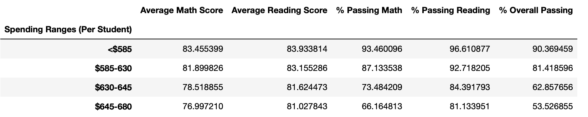
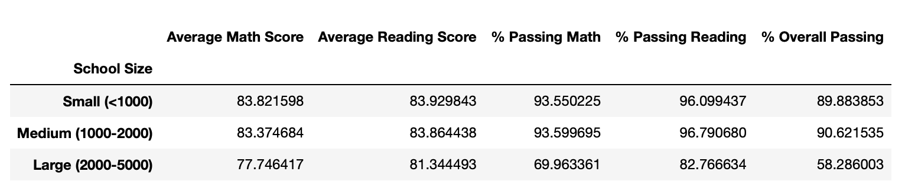
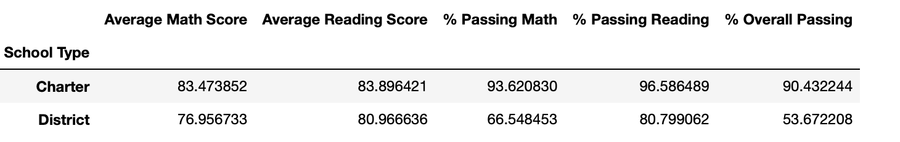
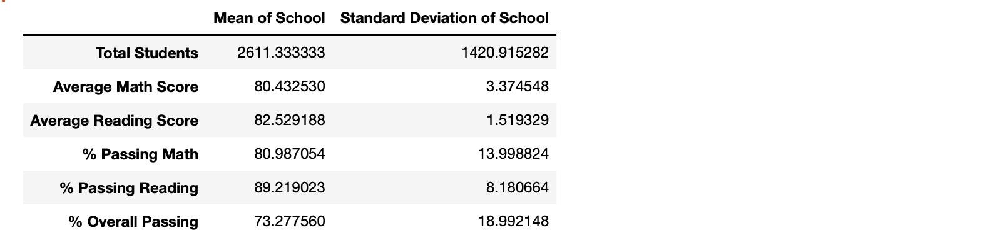
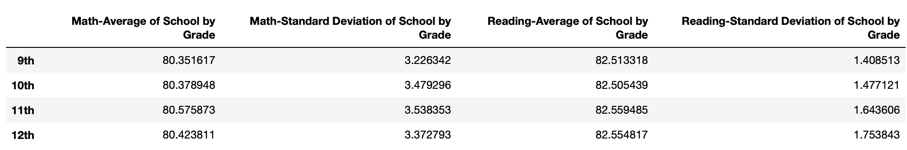
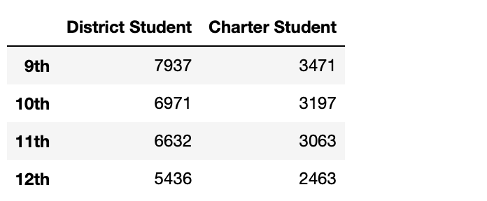
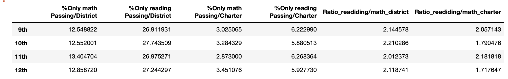

# PyCity Schools Analysis

## Analysis Report
1. As a whole, schools with higher budgets, did not yield better test results. By contrast, schools with higher spending 645-675 per student actually underperformed compared to schools with smaller budgets (585 per student).

2. As a whole, smaller and medium sized schools dramatically out-performed large sized schools on passing math performances (89-91% passing vs 67%).

3. As a whole, charter schools out-performed the public district schools across all metrics. However, more analysis will be required to glean if the effect is due to school practices or the fact that charter schools tend to serve smaller student populations per school. 

4. As a whole, there is a wide gap in academic achievement between schools in mathematics than that in reading.(on passing math standard deviationd VS. reading - 14.00 vs 8.18)

5. As a whole, the academic gap widens as the grade goes up. In particular, the gap of reading perfomace steadily widens as grade goes up(stadard deviation of reading from 9th to 12th: 1.40, 1.47, 1.64, 1.75). It is not time series data for the same student. For depth research, it is necessary to track time series data for the same student.  

6. In both charter schools and district schools, the number of students decreases as the grade goes up(District scool, Charter school from 7th to 12 th : 7937->5436, 3471->2463). You have to decide whether to allocate the budget for each grade or to allocate the same amount to all students.

7. As a whole, in all school types, there are about twice as many students who passed only reading compared to students who passed only math by grade. Allocating more resources to mathematics compared to reading will increase the passing rate for the oveerall area. In particular, District School shows that students who passed only reading are 2.14(9th), 2.21(10th), 2.01(11th), and 2.11(12th) times more by grade than students who passed only math.

## Data
1. report_1 data: School bujet and Performing
```
#  Calculate averages for the desired columns. 
spending_math_scores = school_spending_df.groupby(["Spending Ranges (Per Student)"]).mean()["Average Math Score"]
spending_reading_scores = school_spending_df.groupby(["Spending Ranges (Per Student)"]).mean()["Average Reading Score"]
spending_passing_math = school_spending_df.groupby(["Spending Ranges (Per Student)"]).mean()["% Passing Math"]
spending_passing_reading = school_spending_df.groupby(["Spending Ranges (Per Student)"]).mean()["% Passing Reading"]
overall_passing_spending = school_spending_df.groupby(["Spending Ranges (Per Student)"]).mean()["% Overall Passing"]
# Assemble into DataFrame
spending_summary = pd.DataFrame({"Average Math Score" : spending_math_scores, "Average Reading Score" : spending_reading_scores,
                                "% Passing Math" : spending_passing_math, "% Passing Reading" : spending_passing_reading,
                                "% Overall Passing" : overall_passing_spending})

# Display results
spending_summary
```


2. report_2 data: Scool size and Performing
```
#  Calculate averages for the desired columns. 
spending_math_scores = school_spending_df.groupby(["Spending Ranges (Per Student)"]).mean()["Average Math Score"]
spending_reading_scores = school_spending_df.groupby(["Spending Ranges (Per Student)"]).mean()["Average Reading Score"]
spending_passing_math = school_spending_df.groupby(["Spending Ranges (Per Student)"]).mean()["% Passing Math"]
spending_passing_reading = school_spending_df.groupby(["Spending Ranges (Per Student)"]).mean()["% Passing Reading"]
overall_passing_spending = school_spending_df.groupby(["Spending Ranges (Per Student)"]).mean()["% Overall Passing"]

# Assemble into DataFrame
spending_summary = pd.DataFrame({"Average Math Score" : spending_math_scores, "Average Reading Score" : spending_reading_scores,
                                "% Passing Math" : spending_passing_math, "% Passing Reading" : spending_passing_reading,
                                "% Overall Passing" : overall_passing_spending})

# Display results
spending_summary
```


3. report_3 data: Scool Type and Performing
```
# Group the per_school_summary DataFrame by "School Type" and average the results.
type_math_scores = per_school_summary.groupby(per_school_summary["School Type"]).mean()
type_reading_scores = per_school_summary.groupby(per_school_summary["School Type"]).mean() 
type_passing_math = per_school_summary.groupby(per_school_summary["School Type"]).mean() 
type_passing_reading = per_school_summary.groupby(per_school_summary["School Type"]).mean() 
type_overall_passing = per_school_summary.groupby(per_school_summary["School Type"]).mean() 

# Use the code provided to select new column data
average_math_score_by_type = type_math_scores["Average Math Score"]
average_reading_score_by_type = type_reading_scores["Average Reading Score"]
average_percent_passing_math_by_type = type_passing_math["% Passing Math"]
average_percent_passing_reading_by_type = type_passing_reading["% Passing Reading"]
average_percent_overall_passing_by_type = type_overall_passing["% Overall Passing"]

# Assemble the new data by type into a DataFrame called `type_summary`
type_summary = pd.DataFrame({"Average Math Score":average_math_score_by_type, "Average Reading Score":average_reading_score_by_type,
                             "% Passing Math":average_percent_passing_math_by_type, "% Passing Reading":average_percent_passing_reading_by_type,
                             "% Overall Passing":average_percent_overall_passing_by_type})

# Display results
type_summary
```

4. report_4 data: On passing math standard deviationd VS. reading standard deviation
```
s_t_d=per_school_summary.std()
m_e_a_n=per_school_summary.mean()
m_e_d_i_a_n=per_school_summary.median()
avg_std=pd.DataFrame({ "Mean  of School":m_e_a_n, "Standard Deviation of School":s_t_d})
avg_std
```


5. report_5 data: Grade and standard deviationd 
```
s_t_d_math=math_scores_by_grade.std()
m_e_a_n_math=math_scores_by_grade.mean()
s_t_d_reading=reading_scores_by_grade.std()
m_e_a_n_reading=reading_scores_by_grade.mean()
grade_std=pd.DataFrame({"Math-Average of School by Grade":m_e_a_n_math, "Math-Standard Deviation  of School by Grade":s_t_d_math,
                        "Reading-Average  of School by Grade":m_e_a_n_reading,"Reading-Standard Deviation  of School by Grade":s_t_d_reading})
grade_std
```


6. report_6 data: Student decrease by school type 



7. report_7 data: Only pass on math VS only pass on reading

